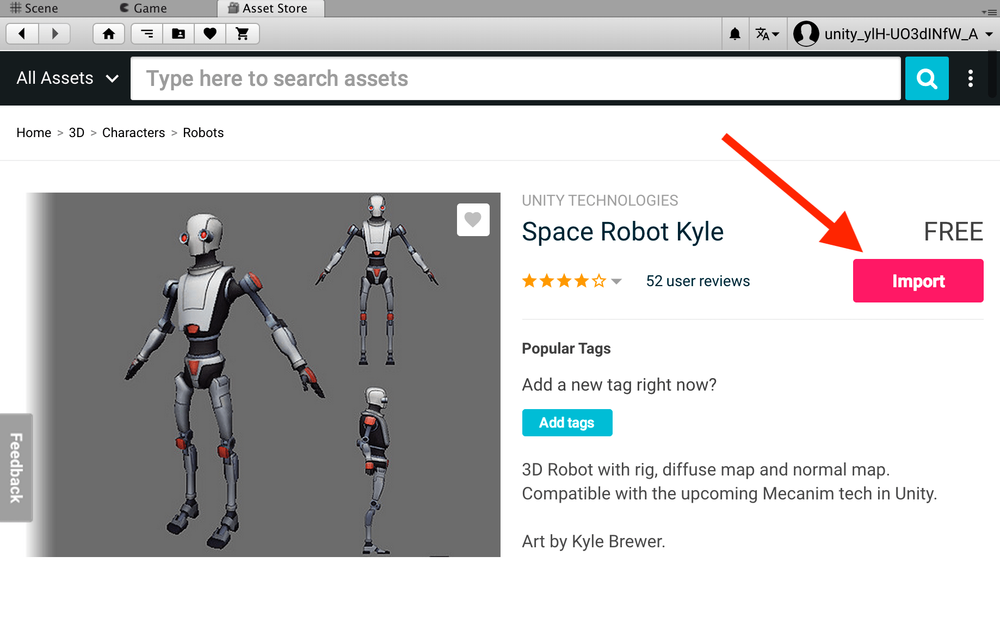

# How to install Assets

## Open Asset Store

  Window > General > Asset Store
  

## Download assets

  Search for "Vuforia Core Samples"

  

  Sign in (or create account)

  

  Import assets

  

  Import assets notification

  

  Import Unity package

  
