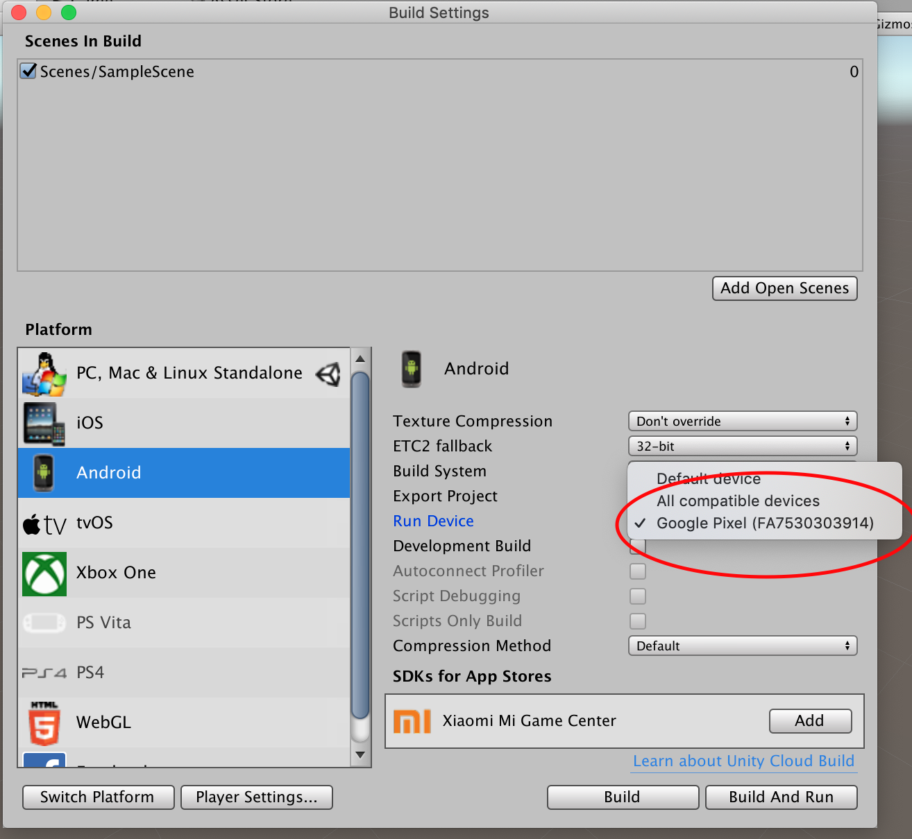
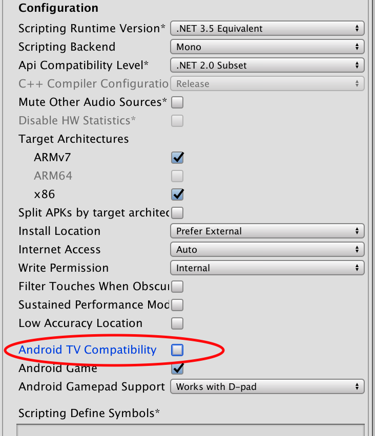

# How to build and deploy to Android

## Enable developer mode in your Android device

1. [Enable developer mode](https://developer.android.com/studio/debug/dev-options#enable) from device settings.

2. Connect your Android device to your laptop via USB. Approve the laptop USB connection in your mobile device UI.

## Install Android module

1. Download and install Android module if it is missing

    File > Build Settings

2. Restart Unity

3. You should see your device listed in the Android section.
    

## Build for Android

1. Open File > Build Settings
2. Select your scene from "Scenes in Build"
3. Select Android Platform
4. Click Switch Platform button
5. Open Player Settings
6. Make sure "Vuforia Augmented Reality" is selected
7. Set **unique** "Bundle identifier" in Other Settings
8. Untick the Android TV support in Other Settings.

    

9. Click Build And Run button 
10. Choose a folder to save the APK to (create e.g. a dedicated builds folder). The app should be launched.

[See Unity instructions](https://unity3d.com/learn/tutorials/topics/mobile-touch/building-your-unity-game-android-device-testing)
