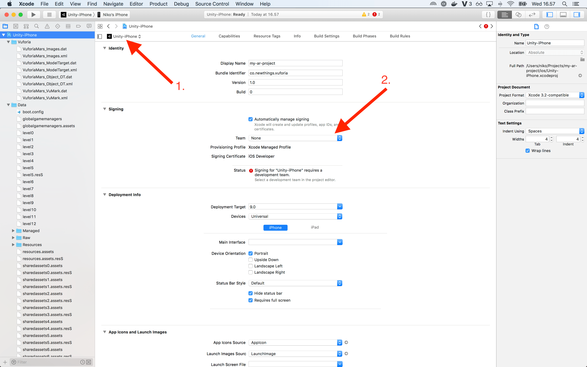
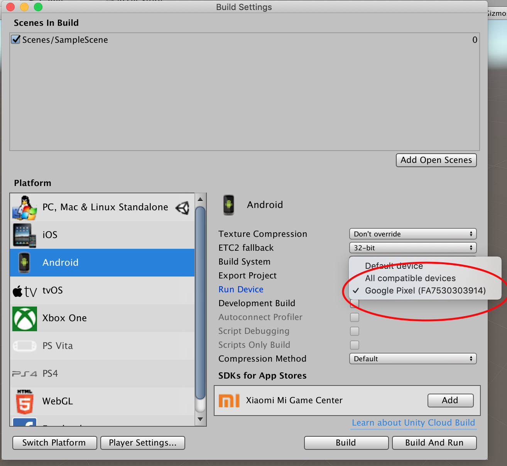

# How to build and deploy to mobile device

## iOS

### Install iOS module

1. Download iOS module

    File > Build Settings
    

2. Install iOS module
    

3. Restart Unity

### Build for iOS

1. Open File > Build Settings
2. Select iOS Platform
3. Click Switch Platform button
4. Open Player Settings
5. Make sure "Vuforia Augmented Reality" is selected
6. Set **unique** "Bundle identifier" in Other Settings
7. Click Build button 

### Open in Xcode

File > Open

Set signing team for target

### Deploy to device

1. Connect your iOS device to your laptop via USB
2. Deploy app to your device

## Android

### Enable developer mode in your Android device

1. [Enable developer mode](https://developer.android.com/studio/debug/dev-options#enable) from device settings.

2. Connect your Android device to your laptop via USB. Approve the laptop USB connection in your mobile device UI.

### Install Android module

1. Download and install Android module if it is missing

    File > Build Settings

2. Restart Unity

3. You should see your device listed in the Android section.
    

### Build for Android

1. Open File > Build Settings
2. Select Android Platform
3. Click Switch Platform button
4. Open Player Settings
5. Make sure "Vuforia Augmented Reality" is selected
6. Set **unique** "Bundle identifier" in Other Settings
7. Untick the Android TV support in Other Settings.

    

8. Click Build And Run button 
9. Choose a folder to save the APK to (create e.g. a dedicated builds folder). The app should be launched.

[See Unity instructions](https://unity3d.com/learn/tutorials/topics/mobile-touch/building-your-unity-game-android-device-testing)