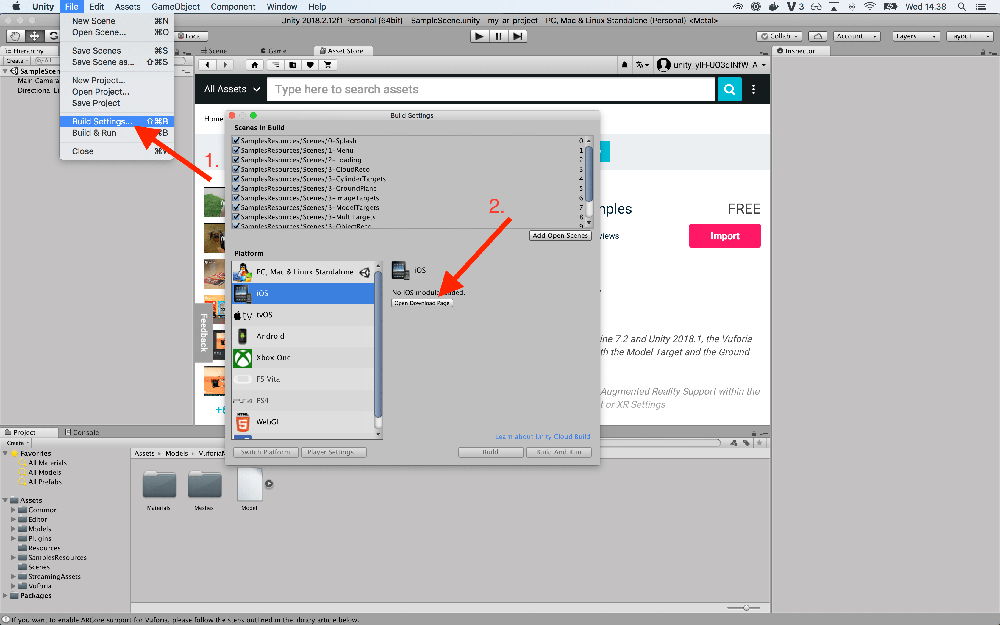
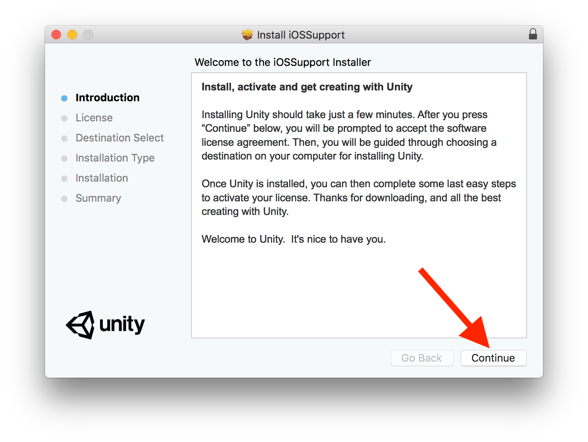
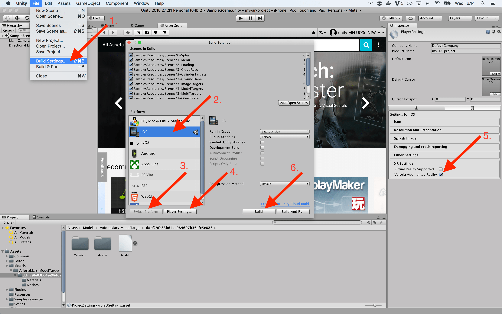
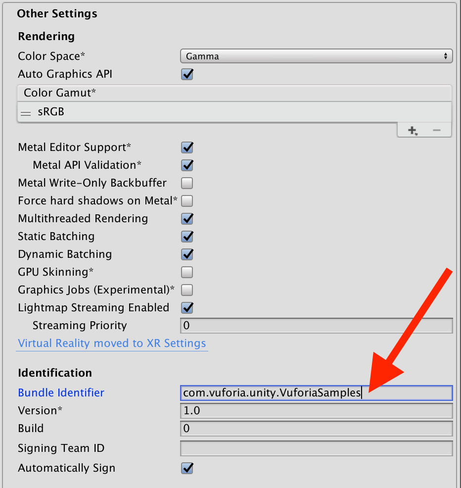
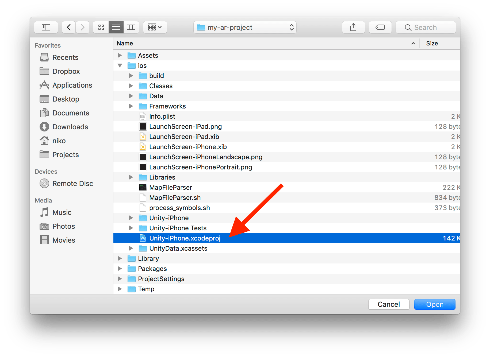
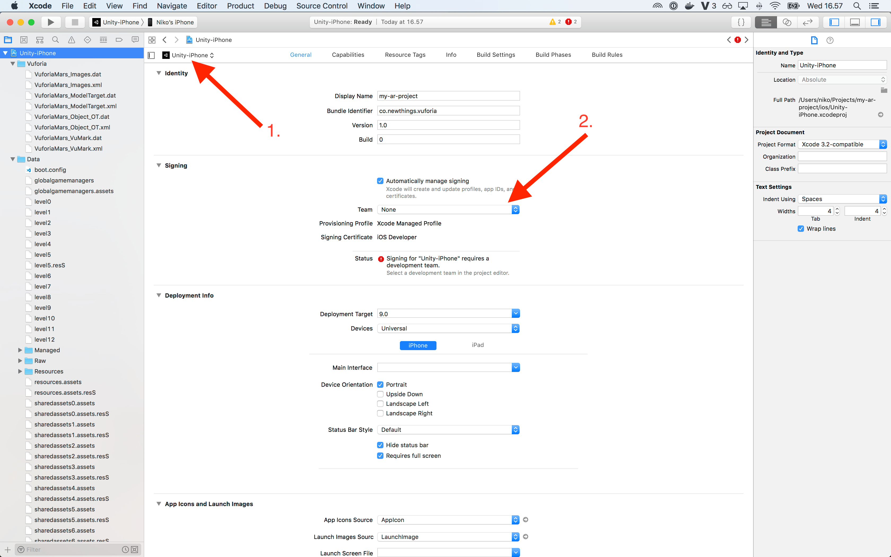
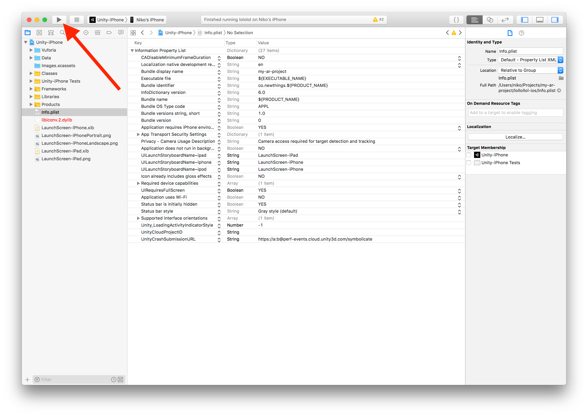

# How to build and deploy to iOS

## Install iOS module

1. Download iOS module

    File > Build Settings
    

2. Install iOS module
    

3. Restart Unity

## Build for iOS

1. Open File > Build Settings
2. Select your scene from "Scenes in Build"
3. Select iOS Platform
4. Click Switch Platform button
5. Open Player Settings
6. Make sure "Vuforia Augmented Reality" is selected
7. Set **unique** "Bundle identifier" in Other Settings
8. Click Build button

## Open in Xcode

File > Open

Set signing team for target

## Deploy to device

1. Connect your iOS device to your laptop via USB
2. Deploy app to your device

[More instructions on Unity page](https://unity3d.com/learn/tutorials/topics/mobile-touch/building-your-unity-game-ios-device-testing)
