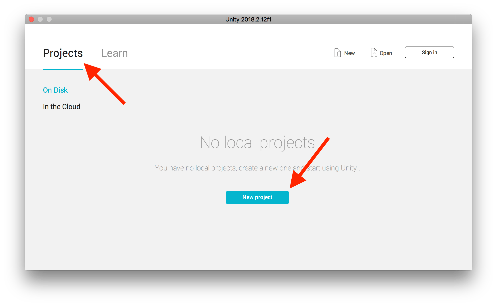
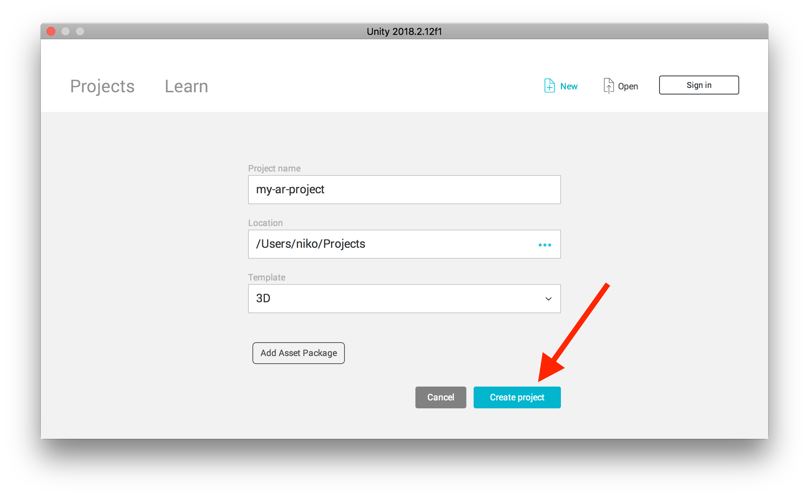
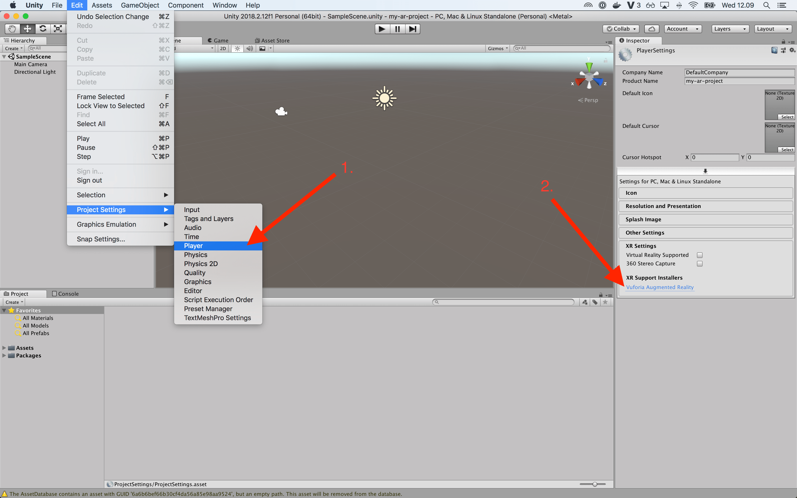
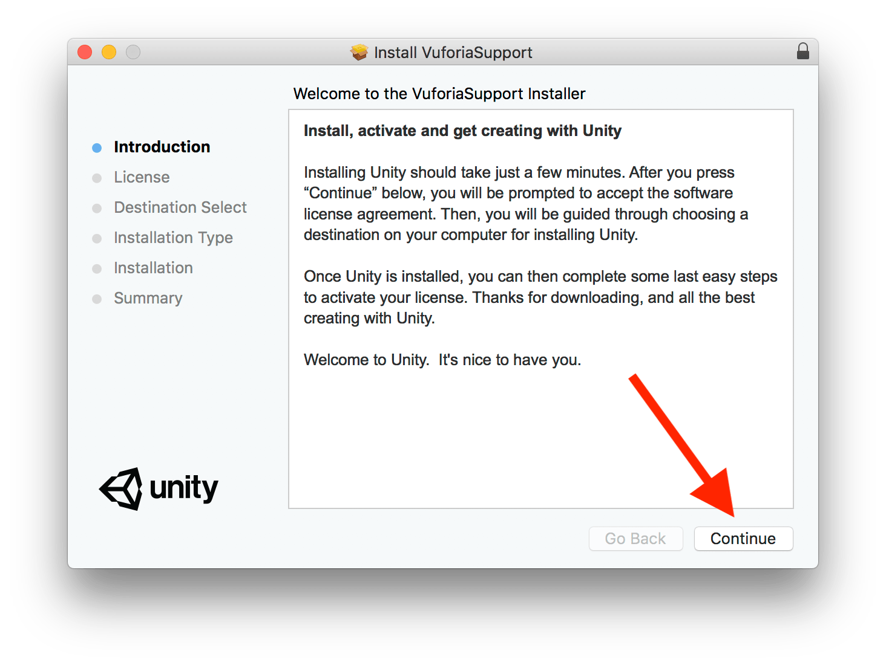
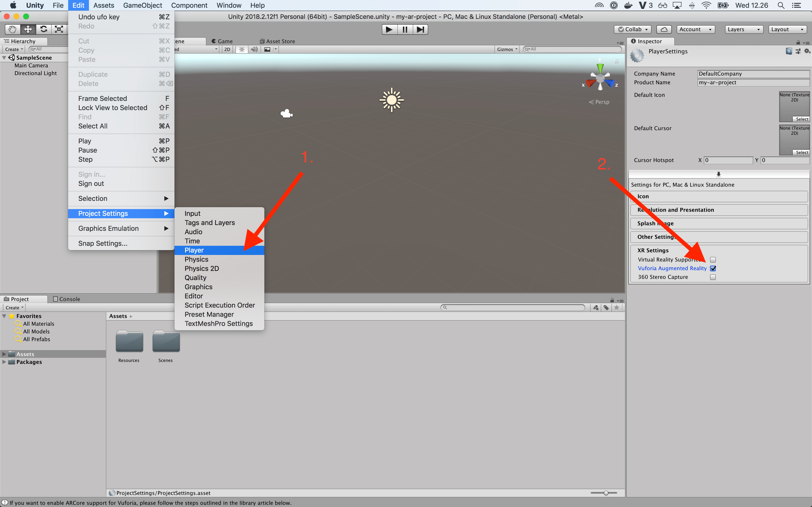
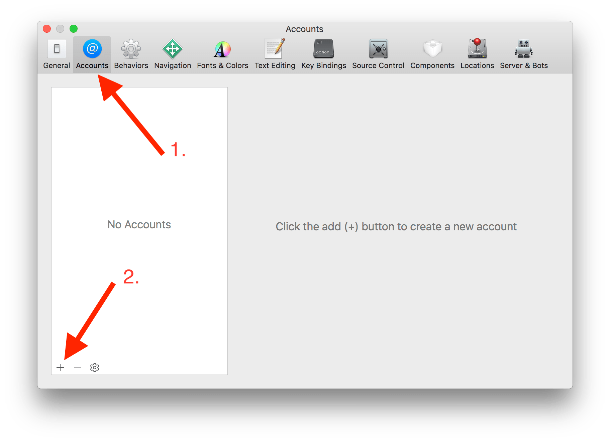
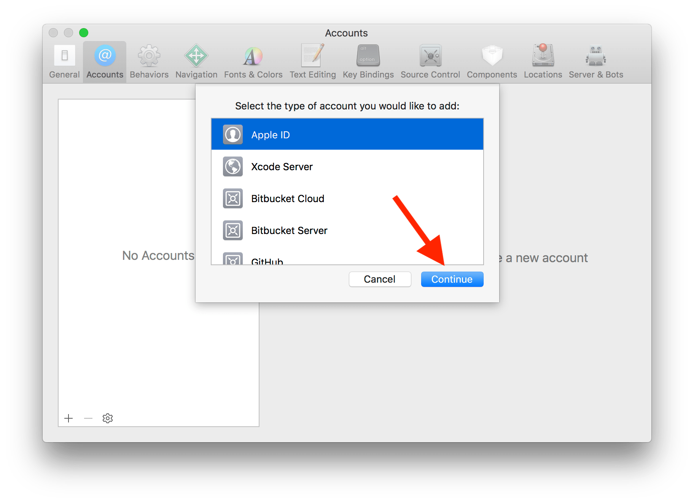
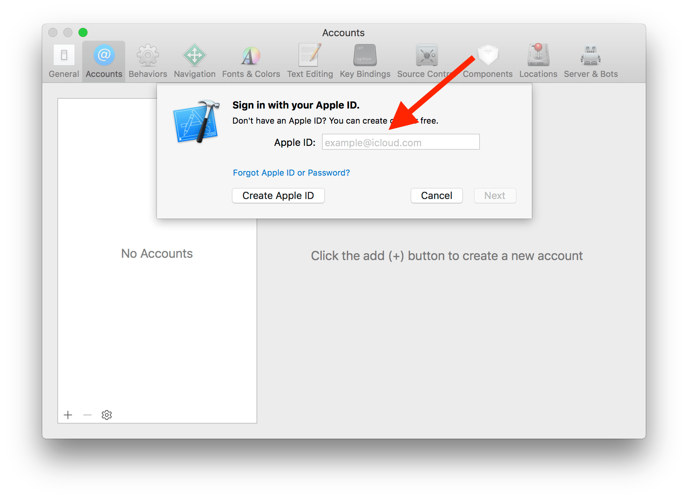

# How to setup Unity and Vuforia

## MacOS

### Install [Unity 3D](https://unity3d.com/)

    brew cask install unity

### Launch Unity

    open /Applications/Unity/Unity.app

### Sign in (or skip it)

  

### Create new project

  
  

### Install [Vuforia](https://www.vuforia.com/)

1. Download Vuforia installer

    Edit > Project Settings > Player

    

2. Finish Vuforia installer

    

3. Restart Unity

4. Activate Vuforia

    Edit > Project Settings > Player

    

### Install Xcode from [App Store](https://itunes.apple.com/gb/app/xcode/id497799835?mt=12)

  1. Open Xcode

    open /Applications/Xcode.app

  2. Add Apple ID to Xcode

      Xcode > Preferences > Accounts

      
      
      